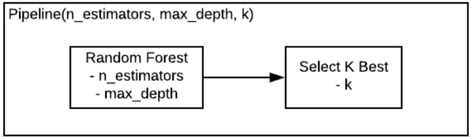

# Designing-Machine-Learning-Workflows
Deploying machine learning models in production seems easy with modern tools, but often ends in disappointment as the model performs worse in production than in development. How to exhaustively tune every aspect of our model in development; how to make the best possible use of available domain expertise; how to monitor our model in performance and deal with any performance deterioration; and finally how to deal with poorly or scarcely labelled data. Digging deep into the cutting edge of sklearn, and dealing with real-life datasets from hot areas like personalized healthcare and cybersecurity.


### Feature selection

- Create fake variables and augment dataset

```python
from np.random import uniform
fakes = pd.DataFrame(uniform(low=0.0, high=1.0, size=n * 100).reshape(X.shape[0], 100), columns=['fake_' + str(j) for j in range(100)])

X_with_fakes = pd.concat([X, fakes], 1)
```

- We use the `SelectKBest` algorithm from the `feature_selector` module to select the 20 highest-scoring columns. We use the `chi2` scoring method. The feature selector has a `fit()` method to fit it to the data,and a `get_support()` method that returns the index of the selected columns.
    
### Data fusion
- Sometimes labeled dataset is not ready, so instead we have to create it from raw data. This poses several challenges, one of which is having to combine information from multiple data sources,a process known as data fusion.

### Imperfect Labels

#### Noiseless or strong labels
- Ground truth
- Human expert labeling

#### Noisy or weak labels
- Heuristic labeling

#### Feature engineering
- We might have to engineer certain custom features to implement these heuristics.

### From workflows to pipelines

#### Revisiting our workflow
- Use a RF algo. Then use grid search cross-validation on the training set to tune the maximum depth of the random forest. Using the best depth, we select the best three features and estimate accuracy on the test data.
- But what if we also wanted to tune the number of estimators used by the RF, as well as the number of features selected?
- Should we split the data further? Does the order in which we optimize the parameters matter?

#### The power of grid search
- Grid search can jointly optimize any classifier parameters.

#### Pipelines
- But what about other parameters in our workflow, like the number of features, k? This is not as easy because these parameters live in different objects.
- The Pipeline module solves this problem by wrapping an entire workflow in a single object.



- This means we can now use GridSearchCV() to optimize the hyperparameters from all the steps in our pipeline in one go!
- Start by creating pipeline object with named steps : in this case, feature selection comes first, followed by the classifier.
    - Next we have to create a parameter grid just like when tuning a single classifier.We will have to name the keys to match the way a pipeline object internally represents its parameters: use the name of the step in question, followed by the name of the parameter in question, separated by a double underscore.
- E.g, classifier__max_depth refers to the parameter max_depth in the classifier step of the pipeline. The value of each key is a list of candidate values for that parameter.
- A pipeline with grid search CV is an extremely flexible and bug-free workflow.

```python
from sklearn.pipeline import Pipeline

pipe = Pipeline([
    ('feature_selection', SelctKBest(f_classif)),
    ('classifier', RandomForestClassifier())
   ])
   
params = dict(
    feature_selection__k = [2,3,4],
    classifier__max_depth = [5,10,20]
   )

grid_search = GridSearchCV(pipe, param_grid = params)
gs = grid_search.fit(X_train, y_train).best_params_
```

#### Customizing our pipeline
- We can also use performance metrics other than accuracy, by overriding the default value of the optional parameter "scoring" in grid search CV.
- If we want to use AUC. We first need to wrap it inside a scorer object, so that it can accept a classifier and data as input, rather than the predicted labels. We can do this using **make_scorer**. 
- We then input the resulting object as the scoring argument in grid search CV.

```python
from sklearn.metrics import roc_auc_score, make_scorer
auc_scorer = make_scorer(roc_auc_score)

grid_search = GridSearchCV(pipe, param_grid=params, scoring=auc_scorer)
```

- Grid search fits one classifier for each value combination. Checking 3 values for each of 3 hyperparameters using 10-fold cross-validation will fit the classifier 270 times.

### Model deployment
- The purpose of a fine-tuned model was to produce insights for a written report. Nowadays, it is more common to deploy models in a production environment, such as a website or a smartphone app.
- Consider a smartphone app that uses machine learning to optimize the user exprience. If we fit a classifier to some trainig data on our laptop, we must then move a copy of it on the production server, where it will start to label new examples.
- This process of exporting a model to a production server is called deployment or pushing to production.

#### Serializing model
- Given that models are complex combinations of code and numbers, it is more efficient to use a binary, rather than a text format. This process is often referred to as "serialization", and in Python it can be done using the module Pickle.

```python
# store a classifier to a file

import pickle
clf = RandomForestClassifier().fit(X_train, y_train)
with open('model.pkl', 'wb') as file:  # w- write, b-binary
    pickle.dump(clf, file=file)
       
# load it again from file

with open('model.pkl', 'rb') as file:
    clf2 = pickle.load(file)
```

#### Serializing pipeline
- What if we wanted to also perform feature selection?
- Without using the **pipeline module**, we would have to export both the **feature selector and the model** from our development environment.

```python
# storing both feature selector and model

vt = SelectKBest(f_classif).fit(X_train, y_train)
clf = RandomForestClassifier().fit(vt.transform(X_train), y_train)

with open('vt.pkl', 'wb') as file:
    pickle.dump(vt)
with open('clf.pkl', 'wb') as file:
    pickle.dump(clf)
```

- We would also need to modify the script running in the production server to first transform the new data using the feature selector, and then feed it to the classifier.
- This goes against the following simple advice : **if possible, use a single object as the only interaction with the production server.** This is because production environments are complicated and, if they break because of a bug, they cause financial losses. So try to keep the interaction with them as simple as possible.

```python
with open('vt.pkl', 'rb') as file:
    vt = pickle.load(file)
with open('clf.pkl', 'rb') as file:
    clf = pickle.load(clf)
clf.predict(vt.transform(X_new))
```

##### All this is yet another reason to use pipelines.
- Consider below pipeline invovling feature selection and model fitting.
- The output of grid search CV is not just a list of optimal parameter values, but an actual estimator object, that supports a predict method. This means the pipeline can be serialized and used just like a model.

```python
pipe = Pipeline([
    ('fs', SelectKBest(f_classif)),
    ('clf', RandomForestClassifier())
    ])
    
params = dict(fs__k = [2,3,4],
    clf__max_depth = [5,10,20])
    
gs = GridSearchCV(pipe, params)
gs = gs.fit(X_train, y_train)

with open('pipe.pkl', 'wb') as file:
    pickle.dump(gs, file)
```

- Moreover, the predict method of a pipeline object includes all transformations that were part of it during fitting, like feature selection, and in this way hides them from the production script. This type of encapsulation is good coding practice.

```python
# Production Environment

with open('pipe.pkl', 'rb') as file:
    gs = pickle.load(gs, file)
gs.predict(X_test)
```

#### Custom feature transformations
- Pipelines allow us to chain several data transformations before the classifier.
- We can even handle a custom transformation using the `FunctionTransformer()` function from the preprocessing module.
- Consider the credit dataset, and assume we wanted to take the negative of the second column. There are two small complications.
- First, we have to copy the dataset rather than modify it in place, to avoid unintended side effects in the rest of our scripts. Second, our function must treat the data as numpy array, bcz pipelines internally convert pandas DataFrames into numpy arrays. This is why we use numpy indexing inside this function rather than pandas iloc().
- Once that is done, all we need to do is wrap our function with the **FunctionTransformer()** and plug it into the pipeline.

```python
def negate_second_column(X):
    z = x.copy()
    z[:,1] = -z[:,1]
    return z
    
pipe = Pipeline([('ft', FunctionTransformer(negate_second_column)),
                 ('clf', RandomForestClassifier())])
```

- Using best scikit-learn practices when we build our workflows makes pushing to production simple and safe.


